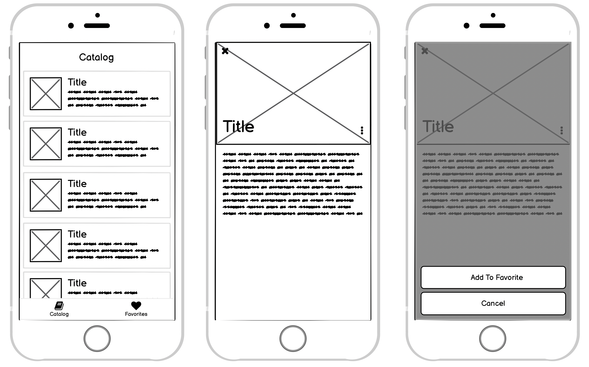

# Тестовое задание на позицию react native разработчика

Разработать простое приложение каталога книг.

Приложение состоит из двух вкладок – каталог и избранное. Дизайн вкладок одинаковый. В списке отображается каталог книг, тап по книге отправляет на детальную страницу книги. Тап по иконке меню(три точки) на детальной странице открывает Action Sheet с контролом добавление/удаления из избранного. 

Приложение должно сохранять состояние – при последующем запуске все добавленные в избранное книги должны остаться в избранном.

Приложение должно использовать навигатор.

Читать книги из файла [books.json](books.json)

